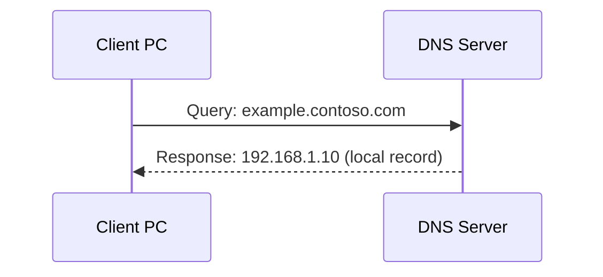
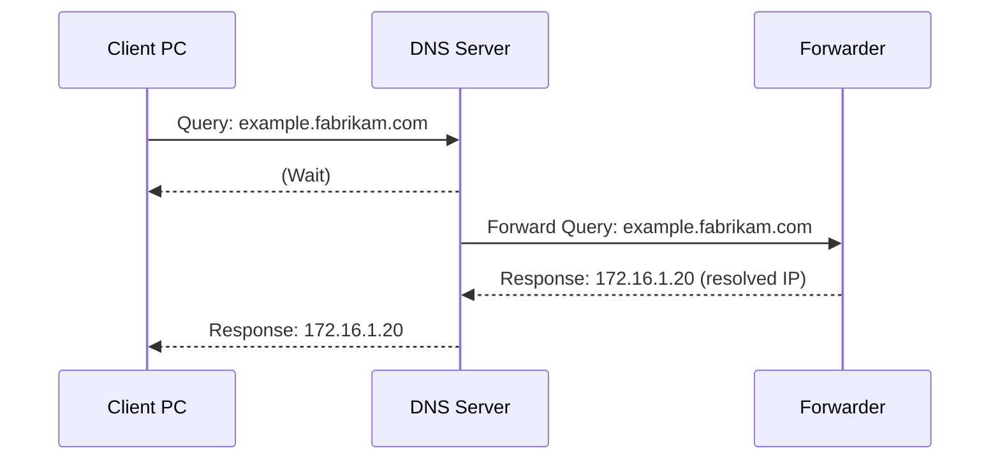
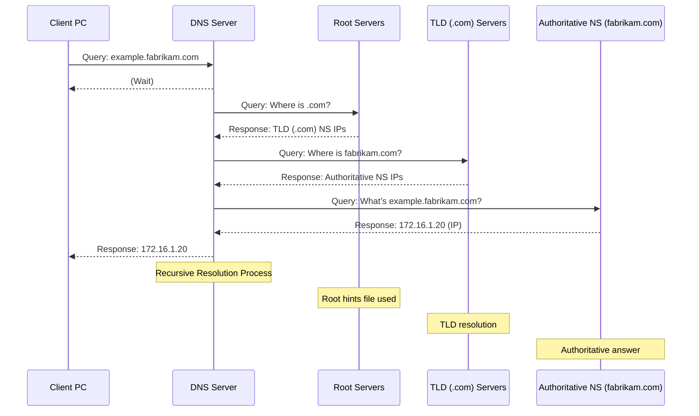

# Explain-DNS

## This repo is a holding area for useful graphs on explaining different DNS Features

### Basic Client Resolution

### Using a Forwarder

### Using Root Servers

### DNS Record Types

| Record Type | Full Name      | Purpose                                                  | Example Use Case            | Key Details                                      |
|-------------|----------------|----------------------------------------------------------|-----------------------------|--------------------------------------------------|
| A           | Address        | Maps a domain name to an IPv4 address.                   | www.example.com → 192.0.2.1  | Defined in RFC 1035; supports multiple A records for load balancing. |
| CNAME       | Canonical Name | Aliases one domain name to another (points to a canonical name). | blog.example.com → www.example.com | Cannot exist at zone apex; may cause issues with mail servers (RFC 2181). |
| AAAA        | Quad-A         | Maps a domain name to an IPv6 address.                   | www.example.com → 2001:0db8::1 | Defined in RFC 3596; used for IPv6-enabled networks. |
| MX          | Mail Exchange  | Specifies the mail server responsible for receiving emails for a domain. | example.com → mail.example.com | Priority value (0–99) determines preferred server; multiple MX records allowed. |
| NS          | Name Server    | Delegates a domain or subdomain to specific nameservers. | example.com → ns1.example.com | Used for zone delegation; cannot be wildcards in Azure DNS. |
| SOA         | Start of Authority | Defines the authoritative information about a DNS zone. | example.com (SOA: ns1, admin@example.com) | Includes serial number, refresh interval; auto-created at zone apex. |
| TXT         | Text           | Stores arbitrary text data, often for verification or security. | example.com → "v=spf1 include:_spf.google.com" | Used for SPF, DKIM, or domain ownership proof. |
| PTR         | Pointer        | Maps an IP address back to a domain name (reverse DNS). | 1.2.0.192.in-addr.arpa → server.example.com | Essential for email validation; defined in RFC 1035. |
| SRV         | Service        | Specifies the location (hostname and port) of services like LDAP or SIP. | _sip._tcp.example.com → sipserver:5060 | Format: _service._proto.name TTL class SRV priority weight port target. |

