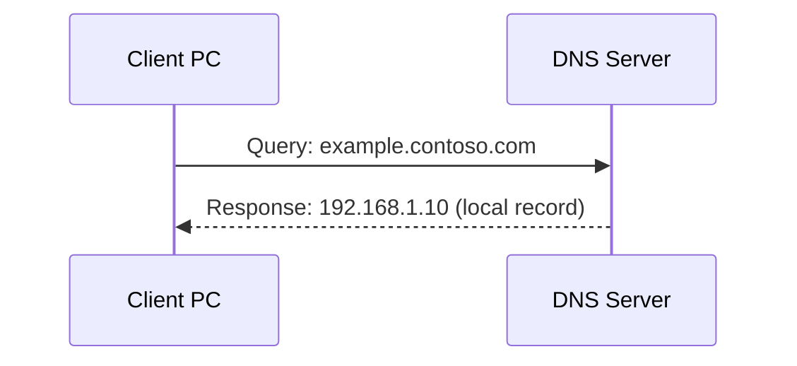

# Explain-DNS

## This repo is a holding area for useful graphs on explaining different DNS Features

### Basic Client Resolution

```mermaid
sequenceDiagram
    participant C as Client PC
    participant S as DNS Server

    C->>S: Query: example.contoso.com
    S-->>C: Response: 192.168.1.10 (local record)
```
