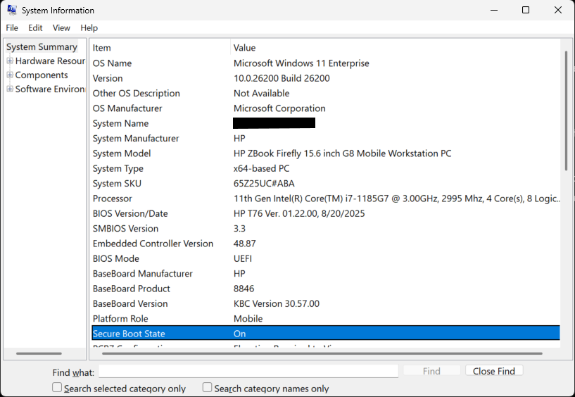
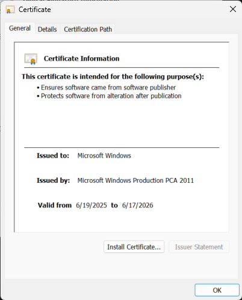
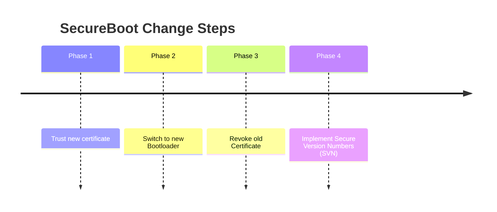
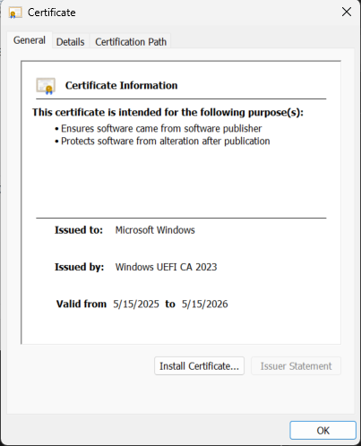

# SecureBoot Changes

In 2026, Microsoft is asking customers to make changes to trust new certificates for SecureBoot to allow continued security updates and improve security.

## What is SecureBoot?

SecureBoot is a *UEFI firmware* feature that requires boot code, including bootloaders and drivers, to be digitally signed by a trusted certificate. SecureBoot is designed to prevent malware from being loaded at boot time.

## Am I using SecureBoot?

SecureBoot is enabled by default on new Windows 11 workstations, was recommended for Windows 10 devices, and can be enabled for Windows Server as well.

### Confirming if SecureBoot is enabled

MsInfo32:



Powershell: This returns True if SecureBoot is enabled.

```Powershell
Confirm-SecureBootUEFI
```

## Why is Microsoft making (~~my life more difficult~~) changes to SecureBoot?

There are two reasons, certificate expiration and to address a security vulnerability in SecureBoot.

### SecureBoot Certificate Expiration

The certificate Microsoft uses for SecureBoot signing will expire on June 17, 2026.



### Security Vulnerability in SecureBoot

An attacker can bypass secureboot by replacing the bootloader with an older signed but vulnerable bootloader, then exploit that to bypass SecureBoot protection.  e.g. BlackLotus CVE-2023-24932.

## So what do we have to do?

The SecureBoot rollout is a multi-step process.

### Secureboot Change Steps



---

#### Phase 1 : Trust the new certificate

In this phase, the new certificate is installed into the UEFI "db" certificate database.  This tells the firmware that code signed by this new certificate is trusted.



##### Phase 1: How do I do this?

For an automated rollout, see the section on Microsoft's managed rollout tools, or for the manual process, run these two commands and then restart the machine:

```powershell
reg add HKEY_LOCAL_MACHINE\SYSTEM\CurrentControlSet\Control\Secureboot /v AvailableUpdates /t REG_DWORD /d 0x40 /f

Start-ScheduledTask -TaskName "\Microsoft\Windows\PI\Secure-Boot-Update"
```

##### Phase 1: What happens if I do this?

Making this change should not have any impact on a system.

##### Phase 1: What happens if I don't do this?

The system will be unable to boot from bootloaders signed with Microsoft's new certificate.

##### Phase 1: How do I confirm this is done?

This can be confirmed with event ID 1808 (success) or 1808 (failure) in the System event log or this powershell command.

```powershell
[System.Text.Encoding]::ASCII.GetString((Get-SecureBootUEFI db).bytes) -match 'Windows UEFI CA 2023'
```

---

#### Phase 2 : Switch to the new BootLoader

In this phase, the bootloader used by windows is replaced with a bootloader signed by a new certificate.

##### Phase 2: How do I do this?

For an automated rollout, see the section on Microsoft's managed rollout tools, or follow this manual process.

Run these two commands and then restart the machine.  Note that this is the same registry key as Phase 1, just a different value.

```powershell
reg add HKEY_LOCAL_MACHINE\SYSTEM\CurrentControlSet\Control\Secureboot /v AvailableUpdates /t REG_DWORD /d 0x100 /f

Start-ScheduledTask -TaskName "\Microsoft\Windows\PI\Secure-Boot-Update"
```

##### Phase 2: What happens if I do this?

This should not have a negative impact.  Specifically, the scheduled task will not apply the bootloader unless the certificate is trusted in the UEFI db and it confirms the bitlocker configuration to verify it will not trigger bitlocker recovery.

##### Phase 2: What happens if I don't do this?

The system will be unable to apply new bootloaders signed with Microsoft's new certificate.

##### Phase 2: How do I confirm this is done?

This can be confirmed with the System event log 1808 (Success) or 1801 (Failure) events.

Alternately, it can also be confirmed by mounting the system's boot volume and checking the digital signature on the boot loader.

---

#### Phase 3 : Revoke the old certificate in the UEFI firmware

In this phase, the old "Microsoft Windows PCA 2011" certificate is specifically marked as untrusted in the UEFI firmware.  **This is a service-impacting change.**  This is done by writing the old certificate's signature into the UEFI untrusted / revoked "dbx" database.

##### Phase 3: How do I do this?

For an automated rollout, see the section on Microsoft's managed rollout tools, or follow this manual process.

Run these two commands and then restart the machine.  Note that this is the same registry key as Phase 1, just a different value.

```powershell
reg add HKEY_LOCAL_MACHINE\SYSTEM\CurrentControlSet\Control\Secureboot /v AvailableUpdates /t REG_DWORD /d 0x80 /f

Start-ScheduledTask -TaskName "\Microsoft\Windows\PI\Secure-Boot-Update"
```

##### Phase 3: What happens if I do this?

**You need to understand the impact of this change before rolling it out.**

The scheduled task that applies this will verify the new certificate is trusted by UEFI,and running the new bootloader. It also confirms the bitlocker configuration to verify it will not trigger bitlocker recovery and looks for firmware known issues related to this change to prevent failures after applying this.

> [Important]
> After applying this change, the system will no longer be able to boot from the old bootloader.  That means it will refuse to SecureBoot from recovery media, USB Sticks, DVDs, ISOs, network boot images, or OS installation media that has not been updated with the new bootloader.

##### Phase 3: What happens if I don't do this?

The system will still be vulnerable to replace-the-bootloader attacks against SecureBoot.

##### Phase 3: How do I confirm this is done?

This can be confirmed with the System event log 1808 (Success) or 1801 (Failure) events.

Alternately, it can also be confirmed with this PowerShell command. Note that this command is looking at the *dbx* UEFI revocation list, in contrast to the *db* UEFI trust list used in phase 1.

```powershell
[System.Text.Encoding]::ASCII.GetString((Get-SecureBootUEFI dbx).bytes) -match 'Microsoft Windows Production PCA 2011' 
```

---

#### Phase 4 : Implement Secure Version Numbers (SVN)

In this phase, Windows adds a new feature to SecureBoot, "Secure Version Numbers".  This feature adds the capability to easily block vulnerable bootloaders in the future by writing a minimum bootloader version number requirement to the UEFI "dbx" revocation database.  **Like Phase 3, this is potentially a service-impacting change.**

##### Phase 4: How do I do this?

For an automated rollout, see the section on Microsoft's managed rollout tools, or follow this manual process.

Run these two commands and then restart the machine.  Note that this is the same registry key as Phase 1, just a different value.

```powershell
reg add HKEY_LOCAL_MACHINE\SYSTEM\CurrentControlSet\Control\Secureboot /v AvailableUpdates /t REG_DWORD /d 0x200 /f

Start-ScheduledTask -TaskName "\Microsoft\Windows\PI\Secure-Boot-Update"
```

##### Phase 4: What happens if I do this?

**You need to understand the impact of this change before rolling it out.**

This adds to the protections in Phase 3 by setting a minimum version number for the Windows bootloader in the UEFI firmware. This means that future updates can increment this version number and the system will no longer be able to SecureBoot from recovery media, USB Sticks, DVDs, ISOs, network boot images, or OS installation media that has not been updated with the new bootloader.

##### Phase 4: What happens if I don't do this?

The system will be vulnerable to replace-the-bootloader attacks against SecureBoot for any bootloaders published and signed with the new certificate.

##### Phase 4: How do I confirm this is done?

A powershell script is available to confirm this.

---

## Automated Deployments (the easy button)

Microsoft will automatically update some "High Confidence" known-good configurations with each monthly cumulative update starting in January 2026.

Guidance for deployments with Intune or GPO are in this article.
[SecureBoot playbook for certificates expiring in 2026](https://techcommunity.microsoft.com/blog/windows-itpro-blog/secure-boot-playbook-for-certificates-expiring-in-2026/4469235)

---

## References

This link contains up-to-date known issue information.

[How to manage the windows boot manager revocations for secure boot changes associated with CVE-2023-24932](https://support.microsoft.com/en-us/topic/how-to-manage-the-windows-boot-manager-revocations-for-secure-boot-changes-associated-with-cve-2023-24932-41a975df-beb2-40c1-99a3-b3ff139f832d)

[SecureBoot Certificate updates guidance for IT professionals and organizations](https://support.microsoft.com/en-us/topic/secure-boot-certificate-updates-guidance-for-it-professionals-and-organizations-e2b43f9f-b424-42df-bc6a-8476db65ab2f)

Event log information for SecureBoot updates:

[SecureBoot DB and DBX variable update events](https://support.microsoft.com/en-us/topic/secure-boot-db-and-dbx-variable-update-events-37e47cf8-608b-4a87-8175-bdead630eb69)

[SecureBoot playbook for certificates expiring in 2026](https://techcommunity.microsoft.com/blog/windows-itpro-blog/secure-boot-playbook-for-certificates-expiring-in-2026/4469235)
